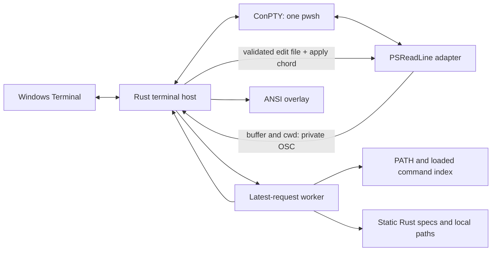

# Architecture and engineering decisions

The first supported platform is Windows Terminal + PowerShell 7. Startup latency has priority over provider coverage.

## Process and language boundary

The executable creates one pseudoterminal and one pwsh process. It does not start a separate shell for each query, shell-state collection, or completion request. Normal operation uses PowerShell's existing profile once. Launch directly from Windows Terminal to avoid paying for an outer pwsh.

Rust owns terminal transport, event coordination, UTF offset conversion, completion, ranking, caching, configuration and rendering. The embedded PowerShell script only adapts supported PSReadLine APIs and the actual shell session. There is no JS runtime, TS transpilation step, npm installation or Node native addon ABI dependency.

The initial implementation uses portable-pty, crossterm, vt100, serde, TOML, and Unicode width/segmentation libraries. These are implementation choices, not a claim that arbitrary terminal emulation is complete.

## Input correctness

PSReadLine owns line editing, history and shell key bindings. After a coalesced edit batch the host asks for the real buffer with the reserved F12,s chord. A maximum of one query is in flight. A generation counter invalidates old completion results when the input changes.

Query chords can terminate PSReadLine's selection or history-search state. The host suppresses queries for selection modifiers and during incremental history search. Windows Ctrl+Backspace uses the native Windows key encoding so its binding is preserved.

Provider ranges are UTF-8 byte offsets. PowerShell ranges are UTF-16 code units. Display placement uses terminal cells. These units are converted explicitly; a range cutting a UTF-16 surrogate pair is rejected.

The owned child console uses UTF-8 for input and output, and protocol JSON escapes non-ASCII characters. This preserves emoji both in the protocol and in PSReadLine's normal redraws. The adapter preserves command success status and LASTEXITCODE for user prompts, including StrictMode before the first native command.

Tab acceptance writes an edit payload and then invokes F12,a. The adapter verifies the complete expected line and cursor, atomically consumes the file, and calls PSReadLine.Replace. Candidate text is data, never an expression to evaluate. A racing edit is discarded rather than applied to a different buffer.

After Enter/Ctrl+C/Ctrl+D, and after an execute event, the host stops injecting PSReadLine keys until another prompt marker. This deliberate conservative rule leaves multi-line completion and some nested interactive workflows for later work.

## Scheduling and caching

Terminal input/output are separate from discovery and completion I/O. The completion worker has a latest-request mailbox and a condition variable. It discards obsolete requests rather than allowing a long queue of keystrokes to accumulate. Input and output channels apply bounded backpressure.

The disk cache is an optimization. It is validated against the actual PATH/PATHEXT snapshot and directory metadata. Failure to read or publish it triggers discovery and cannot prevent shell startup. Session-only functions and aliases are not intentionally persisted across unrelated shell sessions.

Child creation explicitly inherits the launching process environment instead of portable-pty's Windows registry refresh. The index uses the actual child PATH/PATHEXT from prompt events. Replacing a session snapshot also restores executable entries previously shadowed by aliases or functions.

Index initialization begins after the shell prompt so it does not compete with pwsh startup. Directory discovery yields after 256 entries or 4 ms of active work, then continues in the background; the latest query is recomputed as snapshots grow. An individual filesystem call can still exceed that budget. Partial results carry `incomplete: true` and are never saved as a completed index. Local executable links are resolved with bounded depth; broken, directory and explicit remote targets are excluded. PATH order, PATHEXT order and session alias priority are preserved.

Cache schema 2 invalidates old incomplete discovery results. A separate worker persists only the latest complete index; cache hits do not rewrite it. Loaded shell commands arrive in 128-record UUID snapshots. Partial snapshots augment the previous set, and a completed snapshot replaces it, including deletion of old aliases/functions. The remaining synchronous runspace snapshot cost is reported separately in performance results.

Argument completion uses Rust command trees, option scopes and explicit value rules. Git global value options are consumed before subcommands, and `--` ends option completion. Unknown options remain ordinary input. No help command or downloaded specification runs during typing.

Every built-in command, option and static value has a short Chinese description.
Custom `[descriptions]` entries use complete canonical context keys, so option
case and subcommand scope remain distinct. Unknown tools expose their source
with a Chinese fallback; aliases resolve their target before using catalog
text. Configuration reload swaps one shared immutable map and re-queries the
live PSReadLine buffer. The query and renderer do not clone this map on every
keystroke. Completion JSON retains its existing fields, with the additive
`incomplete` discovery flag.

## Rendering

Private OSC frames are stripped from output before display; unrelated OSC is preserved. A vt100 screen tracks the shell's output. The menu is an overlay, and its occupied rows are restored before processing subsequent shell output. Menu code returns bounded ANSI-styled lines, never cursor movement.

One thread owns terminal output to prevent interleaving. Each event batch assembles bytes into a buffer and writes them together. Protocol-only events do not erase an overlay; unchanged content, selection, coordinates and viewport reuse the existing frame. Already queued input events are drained without an extra delay. The host suspends menus in the alternate screen and while a command runs. Terminal resize updates the ConPTY and parser dimensions. Tests compare the restored screen's contents, cursor and attributes.

`run --trace <new-file>` optionally records JSONL timing events. It is off by default. Records contain a fixed stage name, request revision, relative elapsed time, duration and counts as applicable; input text, paste text and candidate descriptions are excluded. The timeline includes terminal input/output queue waits, child input writes, PSReadLine query responses, worker queue waits, static/dynamic completion, redraw and terminal output. Formal benchmarks run with tracing disabled.

Windows console resize events are explicitly enabled, and the original console input mode is restored on exit. After resize, the shell screen is repainted to remove overlay cells reflowed by the outer terminal. Cursor-position requests from nested ConPTY are answered by the owning screen model in a single write.

## Next milestones

1. Reduce startup overhead and end-to-end menu latency using the initial measurements in [performance.md](performance.md). Expand complete-host measurement to representative machines and real user profiles.
2. Expand multiline/nested PowerShell parsing, key-map compatibility, rapid resize and full-screen application replay tests.
3. Add bounded Rust providers for Git branches/remotes and command-specific values, with cancellation, deadlines and cache invalidation.
4. Define a versioned declarative spec format and an optional offline importer. Runtime must remain independent of JS.
5. Add signed/versioned Windows distribution, upgrade flow, and broader platform adapters after Windows acceptance.

The first release is a working Alpha. These milestones are outstanding engineering work, not already-achieved capabilities.
